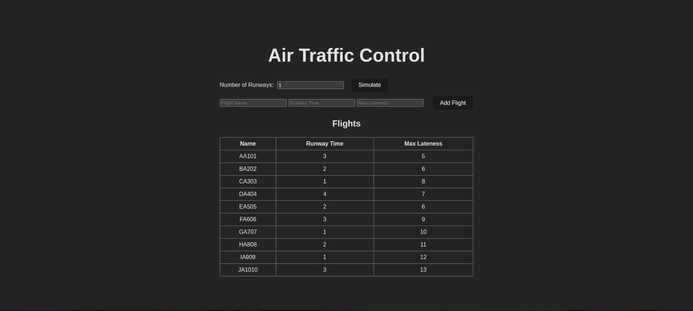
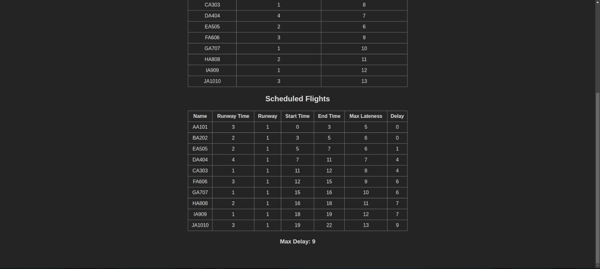

Temas:
 - Algoritmos Ambiciosos

### Link da apresentacao

[APRESENTAÇÃO](https://youtu.be/2yDQhcUZN5E)

# NomedoProjeto
## Air Traffic Control

**Conteúdo da Disciplina**: Algoritmos Ambiciosos 

## Alunos
|Matrícula | Aluno |
| -- | -- |
| 19/0087439  |  Gabriel de Souza Fonseca Ribeiro |
| 19/0091606 |  Lucas Caldas Barbosa de Sousa |

## Sobre 
Esse projeto visa aplicar os conceitos de grafos1 ministrados em sala de aula, foi utilizado algoritmos de busca em profundidade para simular uma rede de conexões em uma rede social. 

## Screenshots

## Instalação 
**Linguagem**:  
**Framework**:  

## Uso 
Para poder rodar o projeto é necessário seguir os seguintes passos:
### Instalação do Node

### Clonar o repositório
### Instalar as dependências com o yarn install ou npm i
### Rodar o projeto com npm run dev 

